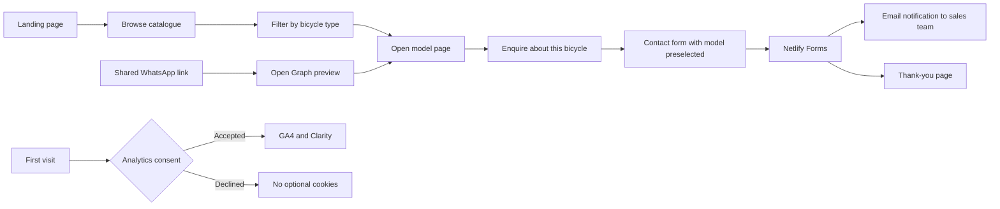
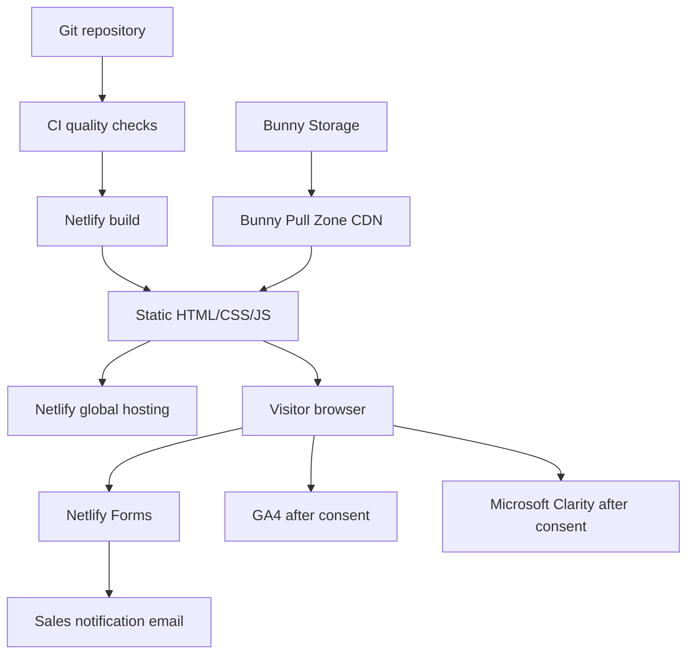

# Bicycle Website Implementation Plan

## 1. Project Summary

Build a responsive, static bicycle catalogue website that presents bicycles professionally and converts visitors into enquiries. The website will not include carts, checkout, online payments, accounts, or direct purchasing. Every sales path will lead to a contact form or clearly displayed business contact details.

The generated production output will be static HTML, CSS, JavaScript, and metadata hosted on Netlify. Product and marketing images will be delivered from Bunny.net CDN. Netlify Forms will receive enquiries and notify the configured business email address.

This is a Standard change. The plan is the only deliverable at this stage; implementation begins only after approval.

## 2. Goals

- Present the bicycle range with strong photography, specifications, categories, and enquiry calls to action.
- Work cleanly on mobile, tablet, laptop, desktop, keyboard, and touch interfaces.
- Make it impossible to mistake the site for an online store: no prices-as-checkout, cart, payment, or Buy Now action.
- Let a visitor enquire about a specific bicycle through a short contact form.
- Deliver reliable WhatsApp and social-link previews with image, title, description, and canonical URL.
- Collect useful, consent-aware traffic and behaviour data through Google Analytics 4 and Microsoft Clarity.
- Provide complete business, privacy, cookie, usage, warranty, and sales disclaimers appropriate to an enquiry-only catalogue.
- Deploy through a reviewable Git-to-Netlify CI/CD flow.

## 3. Non-Goals

- E-commerce checkout, payment processing, inventory reservation, customer accounts, or order history.
- Live stock, dealer, ERP, CRM, or delivery integrations in the first release.
- A CMS or database in the first release.
- User-generated reviews or public comments.
- Claiming IBM affiliation or using IBM trademarks. The design will use an IBM Carbon-inspired enterprise colour system only.

## 4. Decisions and Assumptions

- "Neglify" is interpreted as Netlify.
- Recommended implementation: Astro in static-output mode, with product content stored as validated local data. The final Netlify output remains static.
- Product catalogue content can be updated in Git and redeployed automatically.
- Netlify Forms is the form processor. The owner will configure a verified notification email in Netlify.
- Bunny.net Storage plus a Pull Zone will be the source of all raster and vector image URLs, including product imagery, logo image variants, social preview image, and favicon assets.
- The launch language is English. Additional languages are a future phase unless requested before implementation.
- The legal jurisdiction, business identity, warranty terms, delivery geography, and contact details are not yet known. Legal pages will contain no invented facts and cannot be finalized until these inputs are provided.
- Analytics is non-essential. It will respect the visitor's consent selection and applicable regional requirements.

## 5. Information Architecture

| Route | Purpose | Primary action |
|---|---|---|
| `/` | Brand introduction, featured bicycles, categories, trust signals | Explore bicycles / Enquire |
| `/bicycles/` | Filterable catalogue of all models | View details |
| `/bicycles/[slug]/` | Product gallery, specifications, fit guidance, features, disclaimers | Enquire about this bicycle |
| `/about/` | Company story, values, service area, credibility | Contact the team |
| `/contact/` | General and product-specific enquiry form | Send enquiry |
| `/faq/` | Purchase process, availability, fitting, delivery, service, warranty summary | Ask another question |
| `/privacy/` | Personal-data and analytics disclosures | Manage cookie choices / Contact privacy owner |
| `/cookies/` | Cookie categories, providers, duration, consent controls | Manage cookie choices |
| `/terms/` | Website terms and acceptable use | Contact business |
| `/sales-disclaimer/` | Enquiry-only sales, price, stock, imagery, specification and contract disclaimers | Request confirmed quotation |
| `/warranty-returns/` | Warranty, cancellation, return and service terms, once legally approved | Contact support |
| `/accessibility/` | Accessibility commitment and feedback route | Report an issue |
| `/thank-you/` | Form-submission confirmation and next steps | Return to catalogue |
| `/404.html` | Helpful not-found page | Return home / Browse bicycles |

The header will contain the logo, Bicycles, About, FAQ, and Contact. The mobile version will use an accessible menu. The footer will expose the business identity, contact details, legal links, social links, and copyright notice on every page.

## 6. Core User Journeys

### Enquiry behaviour

- Catalogue cards use "View bicycle" and "Enquire" labels, never "Buy now" or "Add to cart".
- A product enquiry link passes only a non-sensitive model identifier to the contact page and preselects that model.
- Required form fields: name, email or phone, bicycle/model, enquiry type, message, privacy acknowledgement.
- Optional fields: preferred contact method, city/region, expected purchase timeframe.
- The form will state how the submitted data is used and link to the Privacy Policy.
- Successful submission leads to `/thank-you/`; errors remain visible, specific, and keyboard accessible.

## 7. Visual and Responsive Design Direction

### Colour system

Use an enterprise palette inspired by IBM Carbon, without IBM logos or statements of affiliation:

| Role | Planned colour | Use |
|---|---|---|
| Primary | Blue 60, `#0f62fe` | Main actions, links, active controls |
| Primary hover | Blue 70, `#0043ce` | Hover and pressed states |
| Text | Gray 100, `#161616` | Primary copy and navigation |
| Secondary text | Gray 70, `#525252` | Supporting content |
| Surface | White, `#ffffff` | Main canvas and product imagery |
| Alternate surface | Gray 10, `#f4f4f4` | Section separation and controls |
| Borders | Gray 30, `#c6c6c6` | Fields, dividers, cards |
| Success | Green 50, `#24a148` | Confirmations only |
| Error | Red 60, `#da1e28` | Validation and errors only |

- Typography: IBM Plex Sans if its licence and CDN delivery are approved; otherwise a fast system sans-serif stack.
- Product imagery is the visual focus. Avoid decorative gradients, oversized empty hero areas, nested cards, and excessive rounded containers.
- Use square or low-radius product cards, high-contrast controls, clear spacing, and compact specification tables.
- The first viewport must show the bicycle brand, actual bicycle imagery, the catalogue proposition, and a hint of the next section.
- Mobile-first breakpoints will be content driven, approximately 480px, 768px, 1024px, and 1280px.
- Navigation, grids, image aspect ratios, buttons, and filters will have stable dimensions to prevent layout shift.

### Required UI states

- Default, hover, focus-visible, active, disabled, loading, success, empty, and validation-error states.
- Catalogue empty-filter result with a reset action.
- Image loading fallback and meaningful alternative text.
- Consent banner with Accept analytics, Reject analytics, and Preferences actions of equal clarity.
- Persistent footer link to reopen privacy preferences.

## 8. Content and Product Data Model

Each bicycle record should contain:

- Stable slug and model name.
- Category such as road, mountain, hybrid, city, electric, or kids.
- Short summary and full description.
- Intended rider/use, key benefits, and feature list.
- Frame, fork, drivetrain, brakes, wheels, tyres, sizes, colours, weight, and other verified specifications.
- Availability wording such as "Enquire for current availability" rather than unverified stock counts.
- Optional indicative price only if the business wants it, always paired with a quotation/variation disclaimer and no purchase action.
- Bunny.net image URLs, intrinsic dimensions, aspect ratio, focal point, and accurate alternative text.
- SEO title, meta description, canonical path, social preview image, and publish/update dates.
- Warranty summary and any model-specific safety or usage notice.

Content rules:

- Never invent specifications, awards, certifications, testimonials, prices, stock, warranty coverage, or delivery promises.
- Substantive claims require an owner-approved source.
- Use plain, specific language and consistent measurement units.
- Avoid duplicate product copy and keyword stuffing.

## 9. Static Technical Architecture

### Planned project structure

- `src/pages/`: static routes and bicycle detail page generation.
- `src/components/`: header, footer, catalogue, filter controls, product details, contact form, consent controls, and metadata.
- `src/content/` or `src/data/`: validated bicycle records and site-wide business content.
- `src/styles/`: colour tokens, typography, layout, components, and utilities.
- `public/`: non-image essentials only. Images and image-like brand assets use absolute Bunny CDN URLs.
- `tests/`: unit/content validation, accessibility checks, metadata checks, and browser journeys.
- `netlify.toml`: publish path, security headers, redirects, cache policy, and deploy contexts.

JavaScript will be limited to the mobile navigation, catalogue filtering, consent management, analytics loading, and small progressive enhancements. The catalogue, product pages, legal content, and contact form must remain usable without client-side JavaScript.

## 10. Bunny.net Image Delivery Plan

- Create a Bunny Storage Zone for approved originals and a linked Pull Zone for public delivery.
- Prefer a branded image hostname such as `images.example.com` with TLS.
- Use versioned, lowercase, descriptive filenames; never overwrite an image at an existing production URL.
- Define folders for `brand/`, `bicycles/<model>/`, `social/`, `icons/`, and `content/`.
- Enable Bunny Optimizer and generate responsive width variants through image transformation parameters.
- Produce `srcset` and `sizes` for catalogue and product images; preserve width and height attributes to prevent layout shift.
- Use modern WebP/AVIF where compatible, with an appropriate fallback for social crawlers and favicon formats.
- Lazy-load below-the-fold images; eagerly load and prioritize the main above-the-fold bicycle image.
- Set long immutable caching on versioned assets and verify CORS/referrer behaviour where needed.
- Keep an asset register mapping every CDN URL to owner, source, licence, consent/model release, alt text, dimensions, and replacement history.
- Do not expose Bunny API or Storage credentials in browser code, Git, or Netlify build output.

## 11. Contact Form and Email Delivery

- Use a statically rendered Netlify form with a unique form name so Netlify detects it at build time.
- Configure the form notification recipient in the Netlify dashboard; the browser will not contain SMTP credentials.
- Use native HTML validation plus accessible inline error summaries.
- Add a hidden honeypot and Netlify spam filtering. Add CAPTCHA only if real abuse warrants its privacy and usability cost.
- Include a concise consent acknowledgement and link to the Privacy Policy, but do not use consent as a condition for unrelated marketing.
- Store only information necessary to respond. Define a retention period and deletion process before launch.
- Test verified submissions, spam handling, notification subject, reply workflow, failure state, and thank-you redirect on a deployed preview.
- Provide a visible email address and phone/WhatsApp contact only if the business approves them as a fallback.

Netlify documents static form detection and email notifications in its [Forms setup guide](https://docs.netlify.com/manage/forms/setup/) and honeypot/CAPTCHA controls in its [spam-filtering guide](https://docs.netlify.com/manage/forms/spam-filters/).

## 12. Google Analytics and Microsoft Clarity

### Consent model

- Default analytics and advertising storage to denied where consent is required.
- Do not activate optional analytics until the visitor grants analytics consent.
- Store and honour the selection, allow later withdrawal, and expose a footer preference link.
- Send the appropriate consent update to both Google and Clarity.
- Keep advertising/personalisation consent denied unless advertising features are explicitly introduced and legally approved.
- Configure Clarity masking so contact-form values and other sensitive content are never captured. Never send names, email addresses, phone numbers, message text, or stable personal identifiers as analytics parameters.

### GA4 measurement plan

- Automatic page views and engagement after consent.
- `view_item_list`: bicycle catalogue/category viewed.
- `select_item`: bicycle card selected.
- `view_item`: bicycle detail viewed.
- `generate_lead`: contact form successfully submitted.
- `contact_start`: contact form first meaningfully engaged.
- `contact_click`: approved email, phone, or WhatsApp contact link selected.
- `filter_catalogue`: category/filter used, with non-personal values only.
- Mark `generate_lead` as the primary conversion. Avoid duplicate events and document every event and parameter.

Google recommends consent-aware measurement and provides implementation guidance in its [GA4 web guide](https://developers.google.com/analytics/devguides/collection/ga4/web) and [Consent Mode guide](https://developers.google.com/tag-platform/security/guides/consent). Microsoft documents consent behaviour in its [Clarity Consent Mode guide](https://learn.microsoft.com/en-us/clarity/setup-and-installation/consent-mode).

## 13. SEO, WhatsApp Preview, and Favicon

Every indexable page will include a unique title, meta description, canonical URL, robots directive, and language metadata. The site will also provide `robots.txt`, XML sitemap, breadcrumb markup, Organization/LocalBusiness structured data where factually applicable, and Product structured data without fake offers or availability.

### WhatsApp and social sharing

- Set absolute `og:title`, `og:description`, `og:url`, `og:type`, `og:site_name`, and `og:image` metadata.
- Use a versioned 1200 x 630 JPEG social image hosted on Bunny CDN, under a stable HTTPS URL, showing the brand, a clear bicycle, and restrained readable text.
- Include image width, height, type, and alternative text metadata, plus corresponding Twitter/X card tags.
- Product pages may use model-specific preview images; all pages need a safe site-wide fallback.
- Validate the public production URL with social preview debuggers and a real WhatsApp test. Social services cache metadata, so changed previews require a versioned image URL and may not refresh immediately.
- Sharing a link cannot attach a live screenshot. The plan uses a purpose-made image that visually represents the site and remains readable in WhatsApp's cropped preview.

### Favicon package

- Provide ICO, 16px/32px PNG, 180px Apple touch icon, 192px/512px web-app icons, maskable icon, and a web manifest.
- Keep the mark simple and test it at small sizes in light and dark browser chrome.
- Host the image files on Bunny CDN and reference them with absolute URLs. Verify browser compatibility before launch; retain a documented same-origin fallback only if a target browser fails CDN-hosted icons.

## 14. Legal and Disclaimer Content

The following content must be owner-supplied or reviewed by a qualified professional for the launch jurisdiction. Templates are implementation aids, not legal advice.

### Privacy Policy

- Legal business/controller identity and contact details.
- Data collected through forms, server/CDN logs, GA4, Clarity, and consent storage.
- Purpose and lawful basis for each use.
- Processors and data recipients: Netlify, Bunny.net, Google, Microsoft, email provider, and any later service.
- International transfers and relevant safeguards.
- Retention periods by data category.
- Visitor rights, request procedure, complaint authority, children/minor policy, security summary, and policy update date.

### Cookie Policy

- Strictly necessary and analytics categories.
- Cookie/local-storage names, providers, purposes, durations, and first/third-party status.
- Default consent behaviour, how to reject or withdraw, and consequences of declining analytics.

### Website Terms

- Owner details, permitted use, intellectual property, prohibited conduct, third-party links, availability, limitation of liability, indemnity only where enforceable, governing law, dispute venue, severability, changes, and contact channel.

### Enquiry and Sales Disclaimer

- The website is a catalogue and enquiry service, not an offer, checkout, reservation, or binding sales contract.
- Images may show optional equipment or colours and may differ from supplied products.
- Specifications, components, colours, weights, geometry, prices, taxes, delivery charges, promotions, and availability may change and must be confirmed in a written quotation.
- An enquiry or automated acknowledgement does not reserve stock or create an order.
- Final price, included equipment, lead time, payment terms, delivery, assembly, fit, and warranty must be agreed directly with the business.
- Rider suitability and size guidance are general; customers should obtain a professional fit and follow manufacturer limits and safety guidance.
- The business will correct material catalogue errors but does not guarantee uninterrupted or error-free access.

### Warranty, Returns, and Safety

- Exact warrantor, coverage, exclusions, duration, claim evidence, remedy, transport/labour responsibility, and statutory-rights statement.
- Return/cancellation eligibility and deadlines based on the actual sales channel and local law.
- Assembly, inspection, maintenance, helmet/protective equipment, road-law compliance, battery/e-bike handling, load limits, recall, and intended-use notices where applicable.

Legal acceptance criterion: no placeholder, contradictory, copied, or invented legal claim ships to production; the owner records approval and effective date for every legal page.

## 15. Accessibility, Performance, and Security

### Accessibility

- Target WCAG 2.2 AA.
- Semantic landmarks and heading hierarchy, skip link, labelled controls, keyboard operation, visible focus, sufficient contrast, error summaries, reduced-motion support, and 44px touch targets where practical.
- Accurate alternative text for meaningful images; empty alt text for decorative images.
- Responsive tables or definition lists for specifications without horizontal page overflow.
- Test at 200% and 400% zoom and with at least one screen reader on core journeys.

### Performance

- Targets at the 75th percentile on mobile: LCP <= 2.5s, INP <= 200ms, CLS <= 0.1.
- Lighthouse production targets: Performance >= 90 and Accessibility/Best Practices/SEO >= 95 on key templates.
- Minimize JavaScript, preconnect only to required origins, optimize critical CSS and fonts, and avoid autoplay media.
- Define image budgets per template and test on a throttled mobile connection.

### Security

- HTTPS-only with HSTS after domain validation.
- Content Security Policy permitting only required Netlify, Bunny, Google, and Microsoft endpoints.
- `X-Content-Type-Options`, `Referrer-Policy`, frame protection, and a restrictive `Permissions-Policy`.
- No secrets or personal data in repository content, URLs, analytics events, or client logs.
- Dependency review, lockfile, automated audit, spam protection, and quarterly third-party-script review.
- Scope analytics tags to production so deploy-preview traffic does not pollute reports.

## 16. Netlify CI/CD and Environments

- Keep source in a private Git repository with `main` as the production branch.
- Feature branches create pull requests and automatic Netlify Deploy Previews.
- Required CI checks before merge: formatting, linting, type/content validation, unit tests, static build, broken-link scan, metadata validation, accessibility smoke tests, and a dependency/security audit.
- Netlify performs the production build only from `main`; enable Git-based production deploy enforcement.
- Deploy Preview and branch environments use `noindex` and disabled production analytics.
- Use Netlify environment variables for public environment-specific IDs such as GA4 and Clarity project IDs. Store actual secrets only in protected Netlify settings, never in client output.
- Configure custom domain, DNS, TLS, canonical `www`/apex redirect, and rollback procedure.
- Add a post-deploy smoke check for home, catalogue, one product page, contact, legal pages, sitemap, robots, favicon, OG image, and form recognition.
- Document who can deploy, approve production, change DNS/CDN, access submissions, and roll back.

Netlify's [Git workflow overview](https://docs.netlify.com/build/git-workflows/overview/) describes production-branch enforcement, and [Deploy Previews](https://docs.netlify.com/deploy/deploy-types/deploy-previews/) provide per-pull-request review URLs.

## 17. Testing Strategy

| Area | Verification |
|---|---|
| Responsive UI | Browser tests at 320, 375, 768, 1024, 1440, and 1920px plus real touch device |
| Browsers | Current Chrome, Edge, Firefox, Safari, and iOS/Android browsers |
| Catalogue | Filters, empty result, deep links, product content validation, no purchase controls |
| Form | Required fields, keyboard errors, honeypot, success/failure, Netlify capture, email receipt |
| Consent | Fresh visit, accept, reject, change choice, cookie inspection, GA4/Clarity network calls |
| Privacy | No PII in analytics, URLs, session replay, console, or rendered source |
| Social | Canonical metadata, 1200 x 630 image reachability, WhatsApp real-device preview |
| CDN | All rendered image URLs use approved Bunny hostname; no broken or oversized images |
| SEO | Titles, descriptions, canonicals, sitemap, robots, structured data, status codes |
| Accessibility | Automated scan plus keyboard, zoom, contrast, screen-reader and reduced-motion checks |
| Performance | Lighthouse and Core Web Vitals checks on home, catalogue, product, and contact templates |
| Security | Headers, CSP report review, HTTPS redirects, dependency audit, secret scan |

## 18. Phased Delivery and Acceptance Criteria

### Phase 0: Business inputs and approval

Collect brand assets, legal entity data, domain, contacts, target markets, catalogue, verified specifications, image rights, warranty/sales terms, GA4 ID, Clarity ID, Bunny account details, and Netlify ownership.

Pass: all required inputs have named owners, source references, and approval status; unresolved facts are explicitly blocked from publication.

### Phase 1: Foundation and design system

Create the static project, validated content model, reusable layout, IBM-inspired tokens, responsive navigation/footer, and representative page prototypes.

Pass: representative mobile and desktop pages are approved; keyboard and contrast checks pass; production build is static.

### Phase 2: Catalogue and content

Build catalogue, filters, product pages, about, FAQ, and owner-approved copy.

Pass: all approved bicycles render with complete validated data, working images, stable URLs, and no direct-purchase controls.

### Phase 3: Enquiries, consent, and measurement

Build Netlify contact flow, email notification setup, consent preferences, GA4 events, and Clarity with masking.

Pass: a production-like preview delivers a test enquiry email; analytics is absent before/rejected consent and verified after accepted consent; no PII is recorded.

### Phase 4: Legal, SEO, social, and asset delivery

Publish reviewed legal pages, metadata, structured data, sitemap, social image, favicons, and Bunny CDN image pipeline.

Pass: every image resolves from the approved Bunny hostname; legal approval is recorded; WhatsApp shows the correct image, title, description, and destination URL.

### Phase 5: CI/CD, QA, and launch

Configure checks, Deploy Previews, production restrictions, domain/TLS, headers, cross-browser QA, accessibility, performance, and rollback.

Pass: all required checks pass, critical/high defects are zero, owner signs off the production preview, `main` deploys successfully, and post-deploy smoke checks pass.

## 19. Required Owner Decisions Before Implementation

1. Brand name, approved logo, tagline, legal entity name, address, phone, email, and business hours.
2. Primary countries/jurisdictions, currency, taxes, delivery/service area, and minimum visitor age/target audience.
3. Complete bicycle catalogue, verified specifications, optional indicative prices, and stock wording.
4. Rights-cleared product/lifestyle images and whether people/minors appear in them.
5. Warranty, returns, delivery, assembly, fitting, financing, and after-sales policies.
6. Domain name and preferred Bunny image subdomain.
7. Git provider/repository ownership and Netlify/Bunny administrators.
8. Form recipient email, response-time promise, retention period, and enquiry escalation owner.
9. GA4 Measurement ID, Clarity Project ID, consent jurisdictions, and privacy/legal reviewer.
10. Whether phone, direct email, social links, or WhatsApp chat should be shown as secondary contact methods.

## 20. Definition of Done

- The deployed result is static and responsive, with no cart, checkout, payment, or direct buying path.
- A visitor can browse every bicycle and submit a model-specific enquiry that reaches the approved email recipient.
- All images are served from the approved Bunny CDN hostname with responsive sizing and documented rights.
- GA4 and Clarity work only according to the documented consent state and collect no form PII.
- WhatsApp sharing displays the approved image, title, description, and correct canonical link.
- Favicons render across the supported browser/device set.
- Legal and policy pages are complete, consistent, dated, linked site-wide, and owner/legal approved.
- CI checks and Deploy Previews protect production; only the production branch publishes the live site.
- Accessibility, performance, SEO, security, browser, form, and post-deploy acceptance checks pass.

